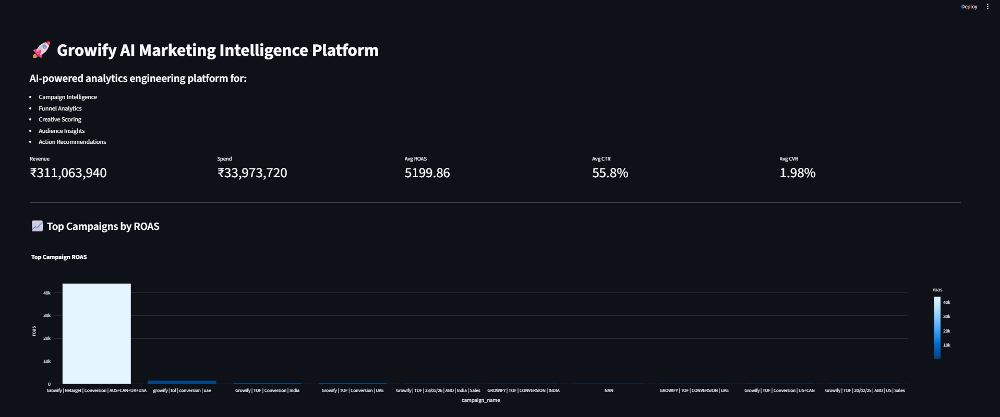
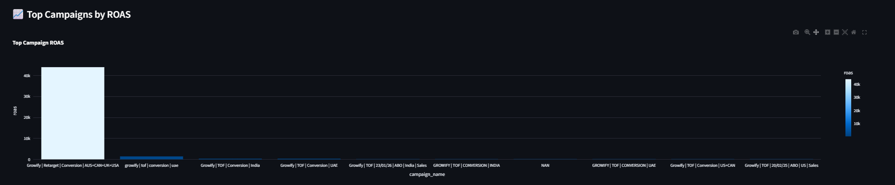
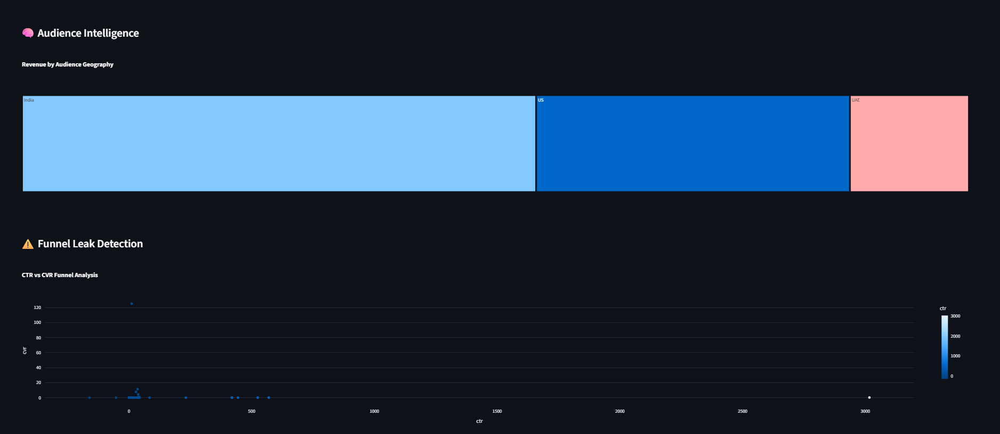
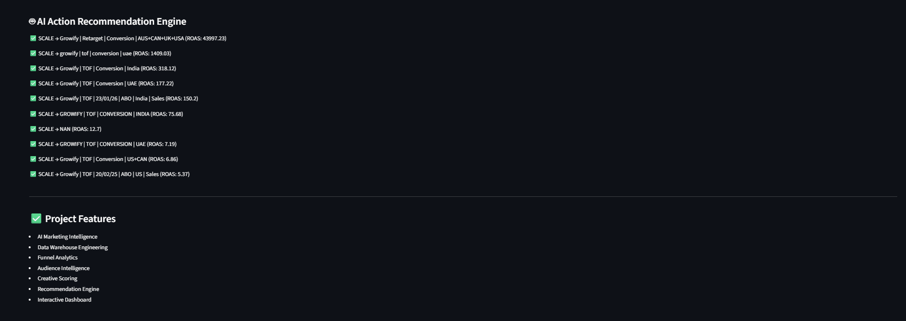

# 🚀 Growify AI Marketing Intelligence Platform

> End-to-end AI-powered analytics engineering platform for campaign optimization, audience intelligence, funnel analytics, and marketing decision intelligence.

Built for the **Growify Digital Data Analyst + AI Developer Assignment**.

---

# 🌟 Project Highlights

✅ End-to-End Analytics Engineering Platform  
✅ AI-Powered Marketing Intelligence System  
✅ Star Schema Data Warehouse  
✅ KPI & Funnel Analytics Engine  
✅ Creative + Audience Intelligence  
✅ Action Recommendation Engine  
✅ Interactive Streamlit Dashboard  
✅ SQL Analytics Layer  
✅ Real Business Intelligence Workflow  

---

# 📸 Dashboard Preview

## Executive Intelligence Dashboard



---

## Campaign Intelligence



---

## Audience Intelligence



---

## AI Recommendation Engine



---

# 📌 Problem Statement

Modern marketing teams generate huge volumes of campaign data across:
- Meta Ads
- Shopify
- audience segments
- creatives
- conversion funnels

But raw data alone is not enough.

Teams need:
- centralized analytics
- KPI tracking
- funnel intelligence
- actionable recommendations
- decision automation

This platform solves that problem by transforming raw campaign datasets into:
# AI-powered business intelligence.

---

# 🧠 What This Platform Does

The system automatically:

✅ Cleans marketing datasets  
✅ Builds dimensional warehouse models  
✅ Calculates advanced KPIs  
✅ Detects funnel leakage  
✅ Analyzes audience performance  
✅ Scores creatives  
✅ Generates optimization recommendations  
✅ Visualizes business intelligence dashboards  

---

# 🏗️ System Architecture

```text
Raw Marketing Data
        ↓
ETL Cleaning Pipeline
        ↓
SQLite Data Warehouse
        ↓
Dimensional Star Schema
        ↓
Analytics & KPI Engine
        ↓
AI Intelligence Layer
        ↓
Interactive Streamlit Dashboard
```

---

# ⚡ Core Features

## 🔄 ETL Data Pipeline

Automated pipeline for:
- campaign ingestion
- Shopify sales processing
- null handling
- schema normalization
- KPI transformations
- anomaly detection

---

## 📊 Analytics Engineering

Built advanced analytics systems for:

### Marketing KPIs
- ROAS
- CTR
- CPC
- CPM
- CVR
- Revenue
- Spend

### Funnel Analytics
- high CTR / low CVR detection
- conversion bottleneck analysis
- funnel leak identification

### Campaign Intelligence
- top-performing campaigns
- spend efficiency analysis
- scaling opportunities

---

## 🎨 Creative Intelligence Engine

Analyzes:
- creative performance
- revenue contribution
- winning ad formats
- creative ROAS impact

Supports:
- video creatives
- carousel creatives
- static creatives

---

## 🧠 Audience Intelligence Engine

Analyzes:
- geo performance
- audience segments
- customer personas
- targeting efficiency

Examples:
- Lookalike audiences
- Retargeting audiences
- Broad targeting
- Interest-based targeting

---

## 🤖 AI Recommendation Engine

The platform automatically suggests:

| Action | Meaning |
|---|---|
| ✅ SCALE | Strong performing campaigns |
| ⚠️ OPTIMIZE | Moderate performance |
| ❌ PAUSE | Underperforming campaigns |

Generated dynamically using campaign metrics.

---

# ⭐ Data Warehouse Design

The system uses a:

# Star Schema Architecture

## Fact Tables

### `fact_campaign_performance`
Stores:
- impressions
- clicks
- conversions
- spend
- revenue
- ROAS
- CTR
- CVR

---

## Dimension Tables

### `dim_campaign`
Campaign metadata & structure

### `dim_creative`
Creative performance attributes

### `dim_audience`
Audience segmentation intelligence

### `dim_date`
Time-based analytics

---

# 🧰 Tech Stack

| Category | Technology |
|---|---|
| Language | Python |
| Database | SQLite |
| Data Processing | Pandas |
| Visualization | Plotly |
| Dashboard | Streamlit |
| Warehousing | SQL |
| Analytics | KPI Engineering |
| AI Layer | Rule-Based Recommendation Engine |
| Architecture | Star Schema |

---

# 📁 Project Structure

```bash
Growify_AI_Platform/
│
├── data/
│   ├── database/
│   ├── reports/
│   ├── campaigns_raw.csv
│   └── Shopify_Raw.csv
│
├── python/
│   ├── data_cleaner.py
│   ├── ai_insight_tool.py
│   ├── ai_insight_tool_v2.py
│   └── dashboard.py
│
├── sql/
│   ├── schema.sql
│   ├── migration_v2.sql
│   └── populate_warehouse.sql
│
├── screenshots/
│
├── README.md
├── requirements.txt
└── POWER_BI_SETUP.md
```

---

# 🚀 How To Run

## 1️⃣ Clone Repository

```bash
git clone https://github.com/Abhyudai-ajax/ACI_Growify_Assignment.git
```

---

## 2️⃣ Install Dependencies

```bash
pip install -r requirements.txt
```

---

## 3️⃣ Run ETL Pipeline

```bash
python python/data_cleaner.py
```

---

## 4️⃣ Run AI Intelligence Engine

```bash
python python/ai_insight_tool_v2.py
```

---

## 5️⃣ Launch Dashboard

```bash
python -m streamlit run python/dashboard.py
```

---

# 📈 Example Insights Generated

## Funnel Leak Detection
Detects campaigns with:
- high CTR
- low conversion rate
- weak checkout performance

---

## Audience Intelligence
Finds:
- best geographic regions
- highest ROAS audiences
- strongest customer personas

---

## Creative Intelligence
Identifies:
- top-performing ad formats
- highest revenue creatives
- scalable ad assets

---

# 🎯 Business Impact

This platform helps marketing teams:

✅ optimize ad spend  
✅ improve ROAS  
✅ detect weak funnels  
✅ identify winning creatives  
✅ scale profitable audiences  
✅ automate campaign intelligence  

---

# 🧪 Assignment Requirements Covered

✅ Data Cleaning  
✅ ETL Engineering  
✅ SQL Warehousing  
✅ Star Schema Modeling  
✅ KPI Engineering  
✅ Marketing Intelligence  
✅ AI Recommendation Engine  
✅ Dashboard Development  
✅ Funnel Analytics  
✅ Audience Intelligence  

---

# 👨‍💻 Author

# Abhyudai Tiwari

AI + Analytics Engineering Project

---
